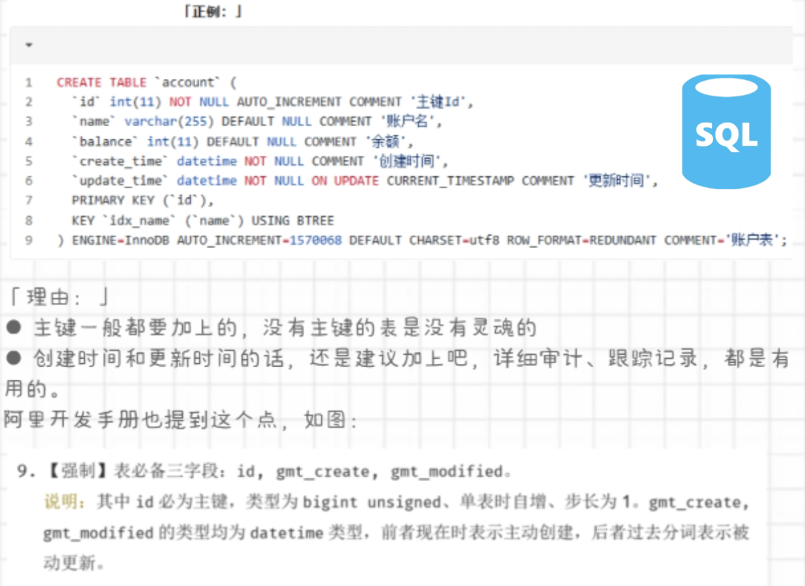

1. 写完SQL后yong`Explain`看一下执行计划,注意有没有走索引
    * `Explain看哪些指标? `
    ```sql
    EXPLAIN
    SELECT * FROM SCORE A
    LEFT JOIN COURSE B ON A.CNO = B.CNO
    LEFT JOIN STUDENT C ON A.SNO = C.SNO
    WHERE CNAME='计算机导论' AND SSEX='男';
    ```
2. 进行`DELETE`和`UPDATE`语句操作时,在最后加个`LIMIT 100`
    * `binlog怎么用?`
    ```sql
    DELETE FROM SCORE WHERE CNO = '101' LIMIT 100;
    ```
    1. 好处
        1. 降低代价
            - 就算错删,也可以通过binlog日志恢复
        2. SQL执行效率更高,避免长事务
            - 加了LIMIT 1,命中后就会立即返回,而没有LIMIT则会扫描整张表
        3. 数据量过大时可能造成cpu过载
            - CPU打满时会越删越慢
3. 建表时加COMMENT
4. 书写规范
5. INSERT时标注插入字段的名称
    ```sql
    INSERT INTO student(sid) VALUES ('123')
    ```
6. 变更SQL的操作应该先测试,并写明详细的操作步骤和回滚方案
    * `怎么写回滚方案? `
7. 建表时强制三个字段
    * `这三个字段的定义方法? `
    1. id
    2. create_time
    3. update_time
    - 
8. 检查WHERE,ORDER BY,GROUP BY后面的列,多表关联的列有没有加索引,且优先考虑组合索引
    * `什么是组合索引? `
    ```sql
    alter table user add index idx_address_age (address,age);
    ```
9. 修改删除操作前备份数据库
10. 注意WHERE后面可能会发生隐式类型转换导致索引失效
    ```sql
    WHERE sid = 123 
    WHERE sid = '123'
    ```
    - 如果sid为字符串型的话,会发生一个隐式转换,转换成浮点型在做比较,这个过程导致index失效
11. 尽量把所有列都定义成`NOT NULL`,这个省空间
12. 修改删除前先SELECT一下
13. 使用SELECT 具体字段替代SELECT *
14. 所有表都使用InnoDB
    1. 支持事务,行级锁,更好的恢复性
    2. 高并发时性能更高
15. 编码统一使用UTF-8
    1. 如果需要存储表情,`utf8mb4`
16. 尽量用varchar(100)替代char(100)
    - 变长字段存储空间更小
17. 更新字段定义后也要更新COMMENT
18. 修改数据时,养成使用begin,commit,开启事务的习惯
19. 索引命名规范
    1. 主键,pk_
    2. 唯一索引,uk_
    3. 普通索引,idx_
20. WHERE从句中不要对列进行函数转换
    - 函数会破坏掉INDEX
    ```sql
    -- X
    WHERE Date_ADD(loginTime,InterVal 7 DAY)>=NOW()
    -- O
    WHERE loginTime >= Date_ADD(loginTime,InterVal -7 DAY)
    ```
21. 如果需要修改的数据过多,可以考虑批量进行
    ```sql
    DELETE FROM account limit 10000;
    for each(200次){
        DELETE FROM account limit 500;
    }
    ```
